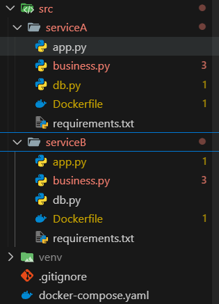
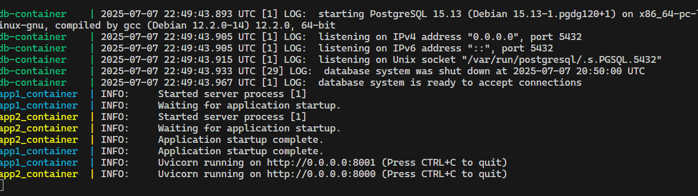
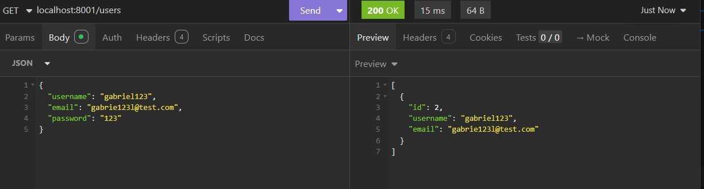
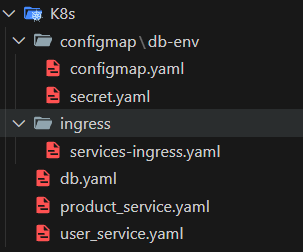
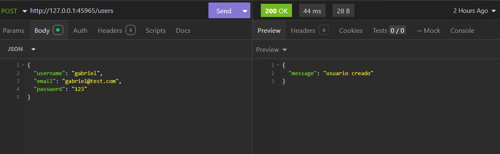
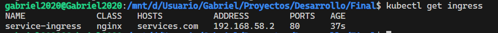

Estudiante: Gabriel Alfonso Castillejo Mendez

CICLO: 2025-I

## DockerFile y docker-compose

#### **Estructura**

Service A: users
Service B: products

**Ejecución de los contenedores**

**Funcionamiento**

## Kubernetes

#### **Estructura**

**Funcionamiento**

- Ingress funcionando:

Observación: Declaro que esta entrega fue realizada sin ayuda externa ni herramientas automáticas
